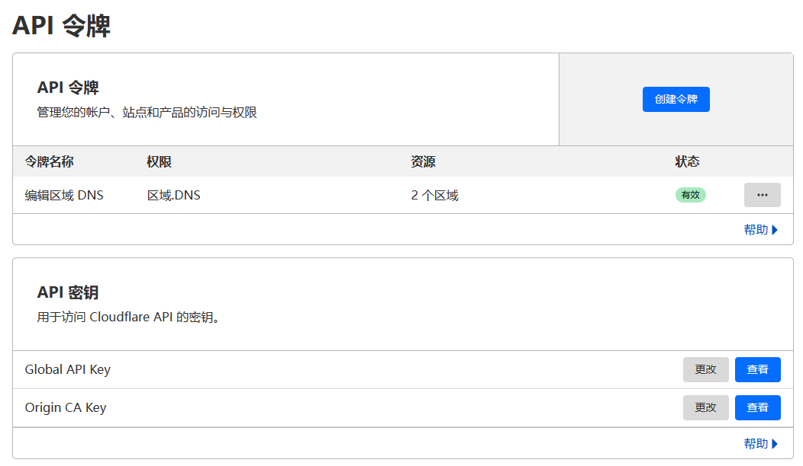

# Caddy Manager

一个 Caddy 管理应用。

- manager 管理面板（含自身节点）
- node 单节点
# 安装指南

确保需要部署的面板鸡和落地鸡都已经安装Docker Compose,全新环境可使用 ```curl -sSL https://get.docker.com/ | sh``` 一键安装

## manger

1. 下载整个manager文件夹到你需要部署的面板鸡上
2. 获取 Github 的 Client ID 和密钥
3. 修改 ```.env.example```中的各项配置，并重命名 ```.env.example```为```.env```
4. 确保 443 端口可用

#### manger目录检查
你的目录应该包括如下所有文件：
```
manager/
├── caddy
│   └── Caddyfile
├── docker-compose.yml
└── manager

```

#### 获取Client ID、Secret

- 登录 Github 后，打开 https://github.com/settings/developers ，依次选择“OAuth Apps” - “New OAuth App”    
`Application name` - 随意填写  
`Homepage URL` - 填写面板的访问域名，如："http://example.com"  
`Authorization callback URL` - 填写回调地址，如："http://cdn.example.com/oauth2-callback"  
- 点击 “Register application” 
- 保存页面中的 Client ID，然后点击 “Generate a new client secret“，创建一个新的 Client Secret，新建的密钥仅会显示一次，请妥善保存

#### 获取 CF Api
- 登录账号并访问 https://dash.cloudflare.com/profile/api-tokens
- 创建令牌 选择“编辑区域 DNS”模板,记录下api
  

#### 修改配置
- 将上一步获取的 id、secret 替换env中的 client_id、client_secret
- 设置或随机生成一个密码（https://suijimimashengcheng.bmcx.com/） 替换env中的 node_secret
- 打开https://api.github.com/users/{你的github用户名} 获取你的id 替换env中的000000
- 修改Caddyfile，如下 （如果面板鸡不当节点请删除 ==== 分割的内容）

```
{
    #debug
    order forward_proxy before reverse_proxy
}
# ==================不当节点删除我================
# 可选节点，:443 是必须的，不能删除
:443, node.caddy-manager.com {
    tls {
         dns cloudflare 【cf api】
    }
    forward_proxy {
        hide_ip
        hide_via
        probe_resistance www.baidu.com
        dashboard {
            use_tls true
            grpc manager.caddy-manager.com:443
            # 节点的 UUID
            server_id 95aba818-f179-422c-84da-8165cf5e528a
            # manager 配置的 NODE_SECTET
            secret_key 969a57c2-b63d-4c31-97a0-e908e66576cb
        }
    }
    # 伪装站点
    reverse_proxy https://google.github.io {
        header_up Host {upstream_hostport}
    }
}
# ==================不当节点删除我================

# 管理面板站点 manager.caddy-manager.com 请改成你自己的域名并且添加对应解析 修改  【cf api】
manager.caddy-manager.com {
    tls {
         dns cloudflare 【cf api】
    }
    reverse_proxy {
        to manager:8080
        transport http {
            versions h2c 2
        }
    }
}

``` 
#### 运行面板
- 进入manager目录后运行 ```docker-compose up -d``` 打开  你修改 manager.caddy-manager.com 后的域名 登录即可进入面板
  

## node

1. 下载整个node文件夹到你需要部署的鸡上
2. 获取 manager生成的 UUID
3. 修改 ```Caddyfile```中的各项配置
4. 确保 443 端口可用 

#### node目录检查
你的目录应该包括如下所有文件：
```
node/
├── caddy
│   └── Caddyfile
└── docker-compose.yaml

```
#### 生成UUID
- 登录上一步中搭建好的面板，进入Nodes,点击ADD，填入相关信息
  
- 复制生成的UUID准备修改Caddyfile
  
- 参照注释修改 Caddyfile
```
{
    order forward_proxy before reverse_proxy
}

# 节点，:443 是必须的，不能删除   node2.caddy-manager.com 修改为你自己的域名 webmaster@caddy-manager.com 选择修改
:443, node2.caddy-manager.com {
    tls {
         dns cloudflare 【cf api】
    }
    forward_proxy {
        hide_ip
        hide_via
        probe_resistance nb.com
        dashboard {
            use_tls true
            grpc manager.caddy-manager.com:443  # 上一步搭建面板鸡的信息
            server_id 6dc58acd-3712-4231-b7c2-1ce042b0a72e  # 获取到的节点UUID
            secret_key 969a57c2-b63d-4c31-97a0-e908e66576cb     # .env中写入的 node_secret
        }
    }
    # 伪装站点
    reverse_proxy https://google.github.io {
        header_up Host {upstream_hostport}
    }
}

# 还可以托管其他站点

```
#### 运行节点
- 进入node目录后运行 ```docker-compose up -d``` 
- 相关客户端配置请谷歌

## 用户配置
- 登录上一步中搭建好的面板，新增Plans，请填写两遍，确保plan下有node
  
  
- 进入Users给用户分配Plan UUID、设置流量限制，即可通畅上网 
  
